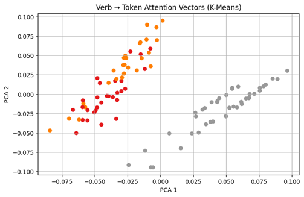

# turkish-attention-structure-analysis

This project analyzes the internal attention patterns of transformer-based language models on Turkish sentences. Instead of focusing on semantic text generation, it examines how verbs distribute attention over other tokens and whether these attention patterns reflect grammatical structure.

Using **XLM-RoBERTa**, the project extracts **verb-to-token attention vectors**, clusters them with **K-Means**, visualizes them with **PCA**, and applies the learned structure to classify new sentences and suggest structurally similar examples.

## Project Objective

The main objective of this project is to investigate whether the attention mechanism of transformer models contains interpretable structural information about Turkish sentence elements such as:

- **subject**
- **object**
- **verb**
- **other**

The project aims to show that even without directly generating language, a model’s attention behavior can reveal meaningful structural patterns.

## Dataset

The dataset consists of **100 simple Turkish sentences** annotated with grammatical role labels. Each sample includes:

- the raw sentence
- tokenized words
- corresponding labels

The labels used in the dataset are:

- `subject`
- `object`
- `verb`
- `other`

Because Turkish words may be split into multiple subword units by the tokenizer, label expansion is applied so that grammatical labels correctly align with tokenized outputs.

## Model Selection

The project initially used `ytu-ce-cosmos/turkish-medium-bert-uncased`. However, this model produced `[UNK]` tokens for several subject and object words, which reduced the reliability of attention analysis.

To address this issue, the project switched to **`xlm-roberta-base`**. Since XLM-RoBERTa uses byte-level BPE tokenization, it avoids unknown token problems and provides more stable token-label alignment. This makes the extracted attention patterns more meaningful and suitable for analysis.

## Methodology

The overall workflow is as follows:

1. Read a Turkish sentence and its grammatical labels
2. Tokenize the sentence using XLM-RoBERTa
3. Expand labels to match subword tokenization
4. Locate the verb position in the tokenized sequence
5. Extract the attention vector from the verb to all tokens
6. Pad vectors to a fixed length
7. Cluster the vectors using **K-Means**
8. Reduce dimensions with **PCA** for visualization
9. For a new sentence:
   - extract its attention vector
   - assign it to the nearest cluster
   - retrieve structurally similar examples from the same cluster

## Visualization

The following figure shows the PCA projection of verb-to-token attention vectors clustered using K-Means:

This visualization suggests that some verb-centered attention patterns form distinguishable groups, indicating that the model may organize certain structural sentence patterns in a consistent way.

## Repository Structure

- `01_attention_extraction_xlm_roberta.ipynb`  
  Extracts verb-centered attention vectors and performs token-label alignment using XLM-RoBERTa.

- `02_cluster_prediction_app.ipynb`  
  Assigns a new sentence to a cluster and recommends structurally similar sentences.

- `03_project_workflow.ipynb`  
  Presents the full project pipeline in an integrated workflow.

- `dataset.xlsx`  
  Contains the labeled Turkish sentence dataset used in the project.

- `kmeans_pca_plot.png`  
  PCA-based visualization of clustered attention vectors.

## Example Use Case

Given a new Turkish sentence, the system:

- tokenizes the sentence
- identifies the verb
- extracts the verb’s attention distribution
- predicts the closest cluster
- returns examples with similar structural attention behavior

This allows the project to move beyond pure analysis and demonstrate a simple structure-based recommendation approach.

## Technologies Used

- Python
- PyTorch
- Hugging Face Transformers
- XLM-RoBERTa
- NumPy
- Pandas
- Scikit-learn
- Matplotlib

## Key Contribution

This project focuses on **how transformer models internally organize sentence structure through attention**. By analyzing verb-centered attention vectors, it offers an interpretable and experimental approach to structural similarity analysis in Turkish NLP.

## Notes

This repository was developed as an experimental academic project. It is intended to explore structural patterns in attention mechanisms rather than provide a production-ready NLP system.
